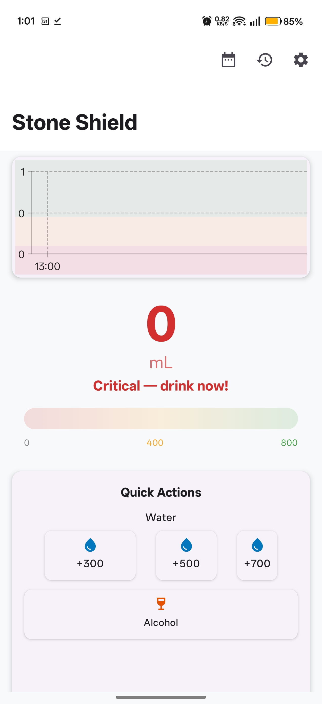
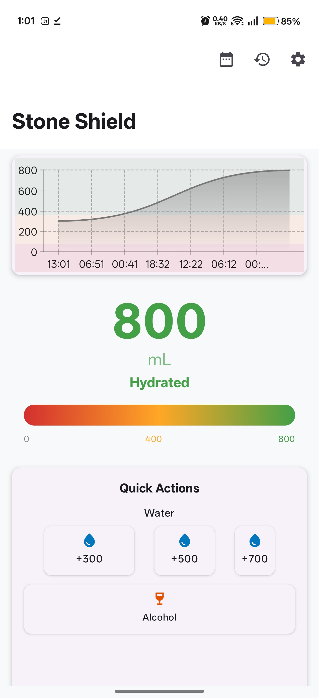
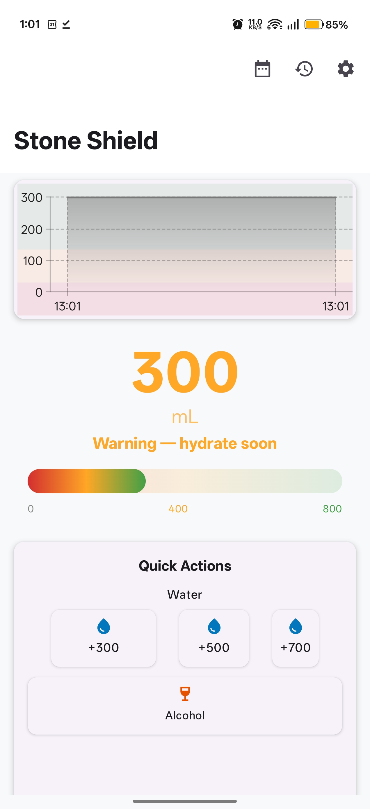
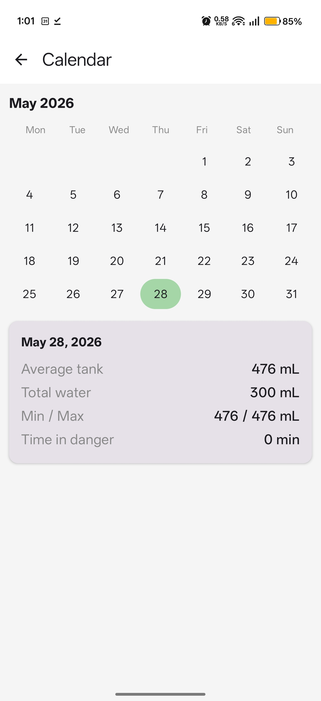
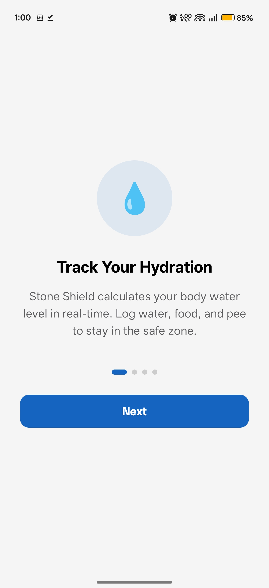
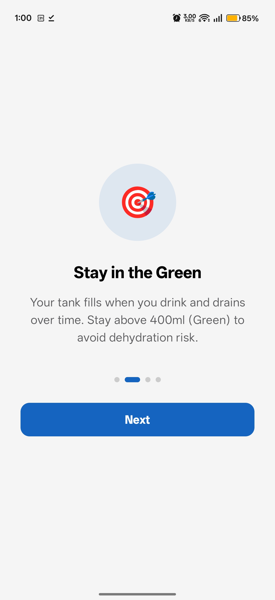
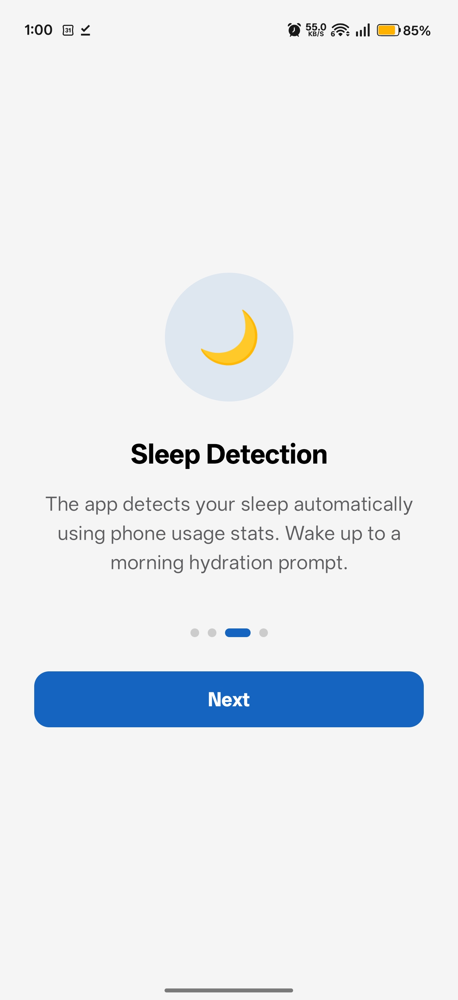
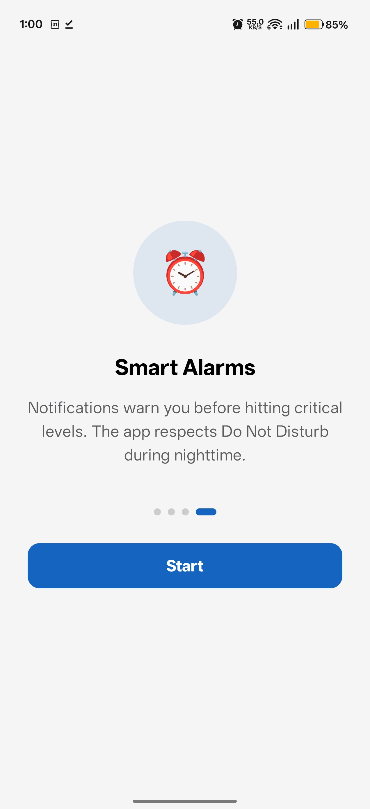
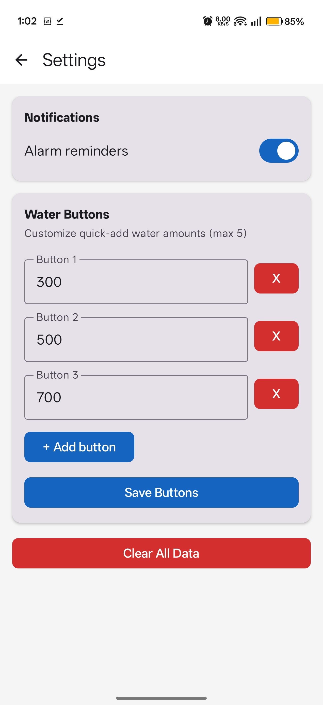

# Stone Shield

**Biological hydration simulator for Android** — prevents kidney stones by minimizing time in the "Danger Zone."

Track your hydration like a fuel gauge: log water intake, pee output, alcohol, and sweat. The math engine calculates your current body water level, predicts when you'll hit critical thresholds, and sends alarms before it's too late.

---

## Screenshots

| Clean Dashboard | Graphed Dashboard | Historical + Calendar | Dashboard with Chart |
|-----------------|-------------------|----------------------|----------------------|
|  |  |  |  |

| Onboarding 1 | Onboarding 2 | Onboarding 3 | Onboarding 4 | Settings |
|--------------|--------------|--------------|--------------|----------|
|  |  |  |  |  |

---

## Features

### Core Mechanics
- **Live tank calculation** — body water level in mL, recomputed on every interaction from scratch.
- **Decay modeling** — awake/sleep decay rates, temperature multiplier (+0.05/°C above 21°C), and alcohol diuretic (1.5× for 120 min).
- **Color Snap** — log pee color to override the math with ground truth (Dark Orange → 0 mL, Yellow → min(current, 300), Clear → 800 mL).
- **Night Protocol** — automatically detects sleep via `UsageStats` (screen-off > 4 h in last 12 h) and recalculates history with sleep decay.
- **Smart Alarms** — `AlarmManager.setExactAndAllowWhileIdle` schedules one-shot warnings before hitting safe (400 mL) or danger (200 mL) thresholds. Can be disabled in Settings.
- **Morning Prompt** — after sleep detection, auto-prompt to drink 500 mL ("Wake up & Flow!").

### User Interface
- **Animated gauge** — big bold mL number, animated on change with color-coded zones (Green / Yellow / Red).
- **Gradient tank bar** — horizontal bar with `Brush.horizontalGradient` from danger-red through warning-yellow to safe-green.
- **Vico line chart** — 24 h hydration trend with pinch-to-zoom, auto-fits to earliest event, and shows future projection (predicted decay).
- **Quick actions** — configurable water buttons (custom count and values in Settings), with Material Icons (`WaterDrop`, `WineBar`, `Wc`, `Bedtime`).
- **Pee Log bottom sheet** — pick color + volume, logs both `pee` and `color_snap` events.
- **Bedtime Check** — "Did you sweat today?" dialog before sleeping (applies light/heavy sweat penalty).
- **Event History** — reverse-chronological timeline. Swipe **left** to delete, swipe **right** to edit value/timestamp.
- **Calendar** — month grid colored by daily hydration status. Tap a day to see its event list. Days with no data show transparent, tap to quick-add water.
- **Snackbar feedback** — every action shows confirmation.
- **Dark mode** — automatically follows system theme.
- **Onboarding** — 4-page intro on first launch.
- **Elevated cards** — chart and quick actions wrapped in `ElevatedCard` with consistent 12 dp corner radius.

### Sensors & Permissions
- **Battery temperature** — one-shot snapshot via `BatteryManager.EXTRA_TEMPERATURE` on interaction; clamped to 21 °C when charging > 1 hr.
- **UsageStats** — screen-off sleep detection (requires Usage Access permission, guided via dialog).
- **Charge time tracking** — `BroadcastReceiver` monitors `ACTION_POWER_CONNECTED`/`DISCONNECTED`, persists to DataStore.
- **Permission dialogs** — explanatory dialogs for Notifications, Exact Alarms, and Usage Access, each with "Open Settings" redirect. App works without them.

### Customization
- **Water buttons** — Settings screen: add/remove up to 5 buttons, each with custom mL value (50–2000).
- **Alarm toggle** — enable/disable notifications in Settings.

---

## Installation

Download the latest APK from [GitHub Releases](https://github.com/tingao/stone-shield/releases).

```bash
adb install app/build/outputs/apk/debug/app-debug.apk
```

Requires **Android 13+** (API 33).

---

## Build

```bash
# Requires: JDK 17+, Android SDK 35
git clone https://github.com/tingao/stone-shield.git
cd stone-shield
export JAVA_HOME=/path/to/jdk-17
./gradlew assembleDebug
```

APK output: `app/build/outputs/apk/debug/app-debug.apk`

> **Note for OneDrive users:** If the project lives inside OneDrive, append `-Dorg.gradle.vfs.watch=false` to avoid file-sync conflicts.

---

## Architecture

```
com.stoneshield.app/
├── domain/              # Pure logic, no dependencies
│   ├── Constants.kt     # Physics constants (decay rates, thresholds)
│   └── HydrationMath.kt # Tank math engine (pure functions)
├── data/
│   ├── local/           # Room DB, EventEntity, DAO, DataStore prefs
│   └── repository/      # TankRepository (orchestrates math + DB)
├── di/                  # Hilt modules (Room, etc.)
├── scheduler/           # AlarmManager, ChargeTimeTracker (BroadcastReceiver)
├── sensor/              # TemperatureProvider, UsageStatsProvider
└── ui/
    ├── dashboard/       # Main screen (gauge, chart, actions, dialogs)
    ├── history/         # Event timeline with swipe-to-delete and swipe-to-edit
    ├── settings/        # Alarm toggle, water button config, clear data
    ├── calendar/        # Monthly grid with per-day event lists
    ├── onboarding/      # First-launch tutorial (4 pages)
    ├── navigation/      # NavHost with routes + SavedStateHandle refresh
    └── theme/           # Material3 light/dark color schemes
```

### "Calculus on Demand"
The app has **no background services**. Every interaction:
1. Queries events from Room DB (last 24 h)
2. Replays the timeline through `HydrationMath` with current sensor data
3. Computes effective decay rate (sleep/temp/alcohol-adjusted)
4. Returns the current tank level
5. Schedules the next `AlarmManager` exact alarm (if enabled)
6. Composable renders the updated state

### Data Model
| Event Type | Value | Effect |
|-----------|-------|--------|
| `water` | mL added | Adds to tank |
| `alcohol` | — | Activates 1.5× diuretic for 120 min |
| `pee` | mL output | Subtracts from tank |
| `color_snap` | PeeColor ordinal | Overrides tank (Dark Orange→0, Yellow→min(cur,300), Clear→800) |
| `sleep` | — | Switches to `BASE_DECAY_SLEEP` |
| `wake` | — | Switches to `BASE_DECAY_AWAKE` |
| `sweat` | 0=light, 1=heavy | Instant penalty −200 or −400 mL |

### Tech Stack
| Component | Choice |
|-----------|--------|
| Language | Kotlin 100% |
| UI | Jetpack Compose + Material3 |
| Architecture | MVVM (ViewModel + Repository + Room) |
| DI | Hilt |
| Database | Room (SQLite) |
| Preferences | DataStore |
| Charting | Vico (Compose-native, pinch-zoom) |
| Async | Coroutines + Flow |
| Alarms | AlarmManager (`setExactAndAllowWhileIdle`) |
| Build | Gradle + Kotlin DSL |

---

## Built With AI

This entire application was built using **[opencode](https://opencode.ai)** and **DeepSeek V4 Flash** — an AI pair programmer, from concept to APK.

No hand-written code. Every line was generated through natural language conversation, iterated via build-feedback loops, and refined based on real device testing.

**Issues and improvements are welcome.** The codebase is fully editable — file an issue, open a PR, or just clone and build.

---

## License

Apache 2.0
